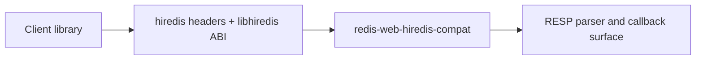
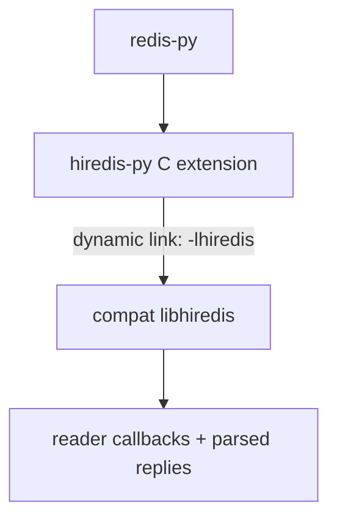
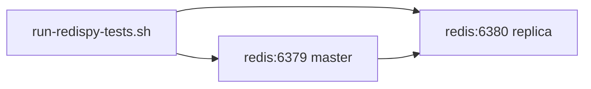

This page documents the hiredis compatibility feature and integration patterns for:

- `redis-py` (through `hiredis-py`)
- Other libraries that link to `libhiredis`

## Feature model

`redis-web-hiredis-compat` exports a hiredis-compatible C ABI (`libhiredis`) so existing consumers can relink without source-level changes.

Current implementation status:

- Full upstream hiredis symbol parity for the pinned upstream version in this repository harness
- Full upstream header API name parity for `hiredis.h`, `read.h`, `alloc.h`, and `sds.h`
- Runtime behavior parity provided by staged upstream hiredis core + async C runtime
- Parser/reader and transport/async behavior validated by redis-py standalone compatibility runs and runtime fixtures

## Integration architecture



## redis-py path

`redis-py` uses `hiredis-py` when available. The `hiredis-py` extension links against `libhiredis`.



The local harness in this repository automates this flow:

1. Build compat artifacts from `crates/redis-web-hiredis-compat`.
2. Patch and rebuild `hiredis-py` to link externally.
3. Install patched wheel into an isolated venv.
4. Run redis-py standalone tests.

### Artifact and script lifecycle

The recommended lifecycle for both validation and one-off consumer runs is:

1. Prepare submodule and redis-py build environment:

```bash
make compat_redispy_bootstrap
```

2. Stage compat headers/libs/pkconfig and build a redis-py+`hiredis-py` wheel against them:

```bash
make compat_redispy_build_hiredis
```

3. Run symbol/header audit before broader runtime checks:

```bash
make compat_redispy_audit
```

4. Optionally include SSL parity verification:

```bash
make compat_ssl_audit
```

5. Run redis-py compatibility smoke/regression:

```bash
make compat_redispy_regression
make compat_redispy_test
```

Artifacts are staged through `subprojects/redispy-hiredis-compat/.dist/hiredis/` and
`.artifacts/` by the script chain, and symbol audits emit:

- `hiredis-missing-symbols.txt`
- `hiredis-missing-vs-upstream-symbols.txt`
- `hiredis-missing-header-api.txt`

### Commands

```bash
make compat_redispy_bootstrap
make compat_redispy_build_hiredis
make compat_redispy_audit
make compat_ssl_audit
make compat_redispy_regression
make compat_redispy_test
```

Manual script flow:

```bash
subprojects/redispy-hiredis-compat/scripts/build-compat-artifacts.sh
subprojects/redispy-hiredis-compat/scripts/build-hiredis-wheel.sh
subprojects/redispy-hiredis-compat/scripts/setup-test-env.sh
subprojects/redispy-hiredis-compat/scripts/run-redispy-tests.sh
```

`setup-test-env.sh` defaults to build/install only (`VERIFY_HIREDIS_ACTIVE=0`), so it does not require a live Redis endpoint unless runtime verification is explicitly enabled.

### Runtime verification

```bash
subprojects/redispy-hiredis-compat/scripts/verify-hiredis-active.py --db 0
```

This checks that `redis-py` is actively using a hiredis parser.

## Redis test topology used by harness



Notes:

- Managed mode is on by default (`MANAGED_REDIS=1`).
- On ARM hosts, the harness defaults docker platform to `linux/amd64` to match redis-py GEO precision fixtures.

## Using with other hiredis-linked libraries

For any library that expects hiredis headers and `-lhiredis`:

1. Build compat artifacts:

```bash
subprojects/redispy-hiredis-compat/scripts/build-compat-artifacts.sh
```

2. Export compiler/linker paths:

```bash
source subprojects/redispy-hiredis-compat/.dist/hiredis/env.sh
```

3. Build your consumer normally (pkg-config or explicit include/lib flags).

4. Set runtime loader paths as needed:

```bash
# macOS
export DYLD_LIBRARY_PATH="subprojects/redispy-hiredis-compat/.dist/hiredis/lib:$DYLD_LIBRARY_PATH"

# Linux
export LD_LIBRARY_PATH="subprojects/redispy-hiredis-compat/.dist/hiredis/lib:$LD_LIBRARY_PATH"
```

5. Validate with the consumer's own tests.

Optional audit hardening:

- `make compat_redispy_audit` runs:
  - hiredis-py extension required-symbol gate (hard fail on missing).
  - upstream hiredis/hiredis_ssl export and header API parity reports.
- `make compat_ssl_audit` additionally validates staged SSL symbol/runtime linkage.
- Set `STRICT_UPSTREAM_PARITY=1` to hard-fail if any upstream parity gaps are detected.

## Compatibility limits

This integration now provides full symbol/header parity and runtime parity by using upstream hiredis runtime sources for staged artifacts.

- Supported: redis-py + hiredis-py compatibility path, strict upstream audit parity, and runtime command/transport behavior.
- SSL parity is provided via staged `libhiredis_ssl` using upstream hiredis split-library semantics.

For implementation-level details and local harness usage, see:

- `subprojects/redispy-hiredis-compat/USAGE.md`
