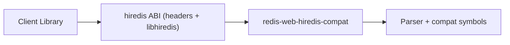
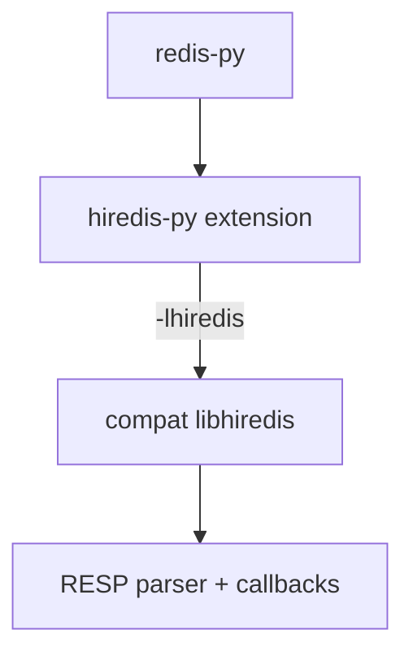
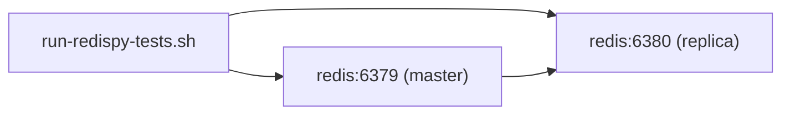

# hiredis compat integration guide

This guide documents the `redis-web-hiredis-compat` feature and how to consume it from:

1. `redis-py` (via patched `hiredis-py`)
2. Other libraries that dynamically link to `libhiredis`

## What this feature is

`redis-web-hiredis-compat` exports a hiredis-compatible C ABI surface (`libhiredis`) so existing consumers can link without changing their source code.

Current scope in this repository:

- Reader/parser ABI used by `hiredis-py` is implemented.
- SDS/allocator and command formatting symbols used by `hiredis-py` are implemented.
- Connection/command execution symbols are exported but remain scaffolded (return unsupported in this phase).

## Architecture



## redis-py usage path

`redis-py` does not link to `libhiredis` directly. It uses `hiredis-py`, whose C extension links to `libhiredis`.



### End-to-end commands

From repository root:

```bash
make compat_redispy_bootstrap
make compat_redispy_build_hiredis
make compat_redispy_test
```

Equivalent script-level flow:

```bash
subprojects/redispy-hiredis-compat/scripts/pin-upstreams.sh
subprojects/redispy-hiredis-compat/scripts/build-compat-artifacts.sh
subprojects/redispy-hiredis-compat/scripts/build-hiredis-wheel.sh
subprojects/redispy-hiredis-compat/scripts/setup-test-env.sh
subprojects/redispy-hiredis-compat/scripts/run-redispy-tests.sh
```

### Runtime verification for redis-py

```bash
subprojects/redispy-hiredis-compat/scripts/verify-hiredis-active.py --db 0
```

This validates:

- `hiredis` Python module imports successfully.
- `redis-py` selected a hiredis-based parser.
- Redis `PING` succeeds with the configured endpoint.

### Redis test topology

The harness can manage Redis automatically:



Defaults:

- `MANAGED_REDIS=1`
- `COMPAT_REDIS_IMAGE_TAG=8.4.0`
- On ARM hosts, default docker platform is `linux/amd64` to match redis-py GEO precision fixtures.

## Using compat libhiredis with other libraries

Any consumer that links against hiredis can be pointed at compat artifacts.

### 1) Build and stage artifacts

```bash
subprojects/redispy-hiredis-compat/scripts/build-compat-artifacts.sh
```

Artifacts are staged at:

- `subprojects/redispy-hiredis-compat/.dist/hiredis/include`
- `subprojects/redispy-hiredis-compat/.dist/hiredis/lib`
- `subprojects/redispy-hiredis-compat/.dist/hiredis/pkgconfig`

### 2) Export build environment

```bash
source subprojects/redispy-hiredis-compat/.dist/hiredis/env.sh
```

Or manually:

```bash
export PKG_CONFIG_PATH="subprojects/redispy-hiredis-compat/.dist/hiredis/pkgconfig:$PKG_CONFIG_PATH"
export CFLAGS="-Isubprojects/redispy-hiredis-compat/.dist/hiredis/include $CFLAGS"
export LDFLAGS="-Lsubprojects/redispy-hiredis-compat/.dist/hiredis/lib $LDFLAGS"
```

### 3) Build your hiredis consumer

Typical examples:

```bash
# pkg-config driven
cc app.c $(pkg-config --cflags --libs hiredis)

# explicit link
cc app.c -Isubprojects/redispy-hiredis-compat/.dist/hiredis/include \
  -Lsubprojects/redispy-hiredis-compat/.dist/hiredis/lib -lhiredis
```

### 4) Set runtime loader path

```bash
# macOS
export DYLD_LIBRARY_PATH="subprojects/redispy-hiredis-compat/.dist/hiredis/lib:$DYLD_LIBRARY_PATH"

# Linux
export LD_LIBRARY_PATH="subprojects/redispy-hiredis-compat/.dist/hiredis/lib:$LD_LIBRARY_PATH"
```

### 5) Audit symbol coverage (recommended)

For consumers similar to `hiredis-py`, run:

```bash
subprojects/redispy-hiredis-compat/scripts/audit-hiredis-symbols.sh
```

This catches missing symbols before runtime.

## Compatibility contract and limits

- Header surface:
  - `crates/redis-web-hiredis-compat/include/hiredis/hiredis.h`
  - `crates/redis-web-hiredis-compat/include/hiredis/read.h`
  - `crates/redis-web-hiredis-compat/include/hiredis/alloc.h`
  - `crates/redis-web-hiredis-compat/include/hiredis/sds.h`
- Library names are ABI-compatible (`libhiredis`).
- Not all hiredis behavior is implemented yet; unsupported execution paths return explicit errors.

If integrating a new hiredis-based consumer, treat parser/symbol linkage as the first gate, then validate behavior with that library's native test suite.
